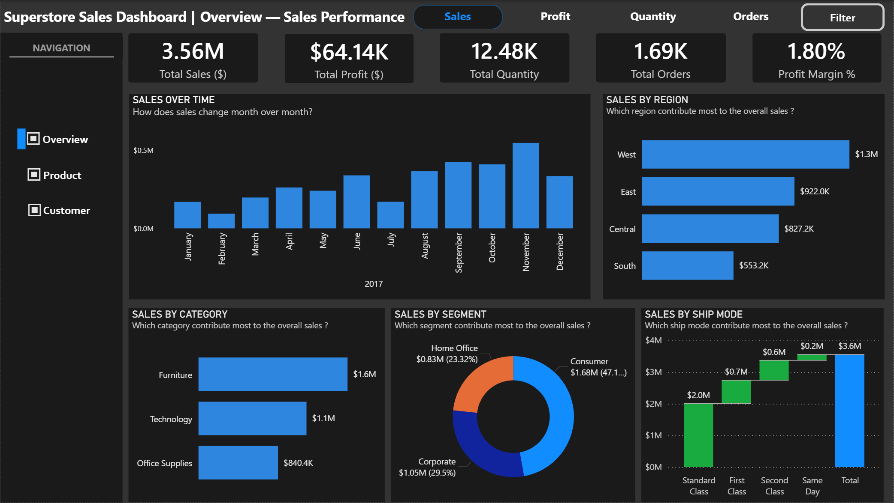
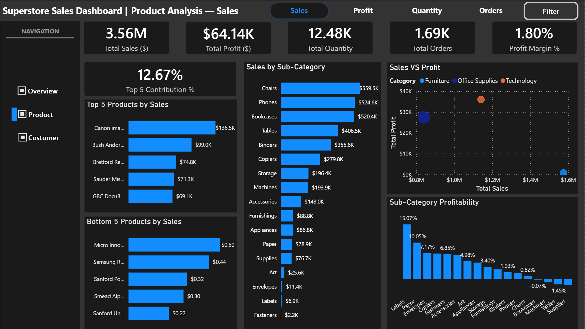
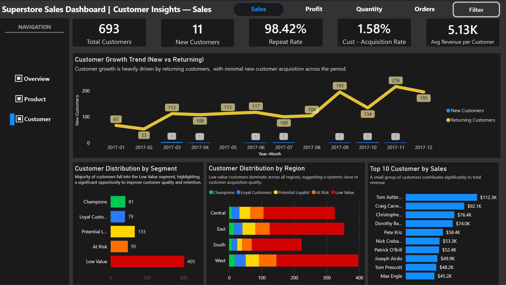

# 📊 Superstore Sales Dashboard (Power BI)

## 📌 Deskripsi Proyek

Dashboard ini dibuat menggunakan Power BI untuk menganalisis performa penjualan dari dataset Superstore.
Tujuan utama dari dashboard ini adalah memberikan insight terkait penjualan, profit, produk, dan perilaku customer secara interaktif.

---

## 🎯 Tujuan

* Menganalisis performa bisnis secara keseluruhan (Overview)
* Mengidentifikasi produk dengan performa terbaik dan terburuk
* Memahami perilaku dan segmentasi customer
* Membantu pengambilan keputusan berbasis data

---

## 📊 Fitur Utama

### 1. Overview Page

* KPI utama: Total Sales, Profit, Quantity, Orders, Profit Margin
* Sales trend bulanan
* Distribusi sales berdasarkan region, category, segment, dan ship mode

### 2. Product Analysis Page

* Top 5 & Bottom 5 produk berdasarkan sales
* Sales per sub-category
* Perbandingan Sales vs Profit
* Profitability per sub-category

### 3. Customer Insights Page

* Total customers & new customers
* Repeat rate & acquisition rate
* Tren customer (new vs returning)
* Segmentasi customer (RFM-based)
* Distribusi customer per region
* Top customer berdasarkan revenue

---

## ⚙️ Teknologi yang Digunakan

* Power BI
* DAX (Data Analysis Expressions)
* Data Modeling
* Data Visualization

---

## 🧠 Insight Utama

* Region West menjadi kontributor terbesar terhadap total penjualan
* Category Furniture memberikan kontribusi sales yang besar, namun dengan margin yang relatif tipis → mengindikasikan potensi inefisiensi atau pricing yang kurang optimal
* Category Technology menunjukkan performa profit yang lebih sehat dengan margin yang lebih tinggi dibanding kategori lainnya
* Office Supplies cenderung stabil dengan kontribusi sales dan profit yang seimbang
* Mayoritas customer berada pada segmen Low Value
* Pertumbuhan customer lebih didorong oleh returning customer dibandingkan akuisisi customer baru

Terdapat anomali menarik pada tren bulanan:
* Pada bulan maret data menunjukkan profit tinggi meskipun sales relatif rendah (high margin 6.24%)
* Sedangkan bulan November memiliki sales tinggi namun margin rendah (~1.63%), mengindikasikan kemungkinan diskon besar atau perubahan product mix

---

## 📷 Tampilan Dashboard

### Overview

### Product Analysis

### Customer Insights

---

## 🚀 Cara Menggunakan

1. Download file `.pbix` dari repository ini
2. Buka menggunakan Power BI Desktop
3. Interaksikan dashboard menggunakan filter dan navigation button

---

## 📁 Dataset

Dataset yang digunakan adalah dataset Superstore (sample dataset untuk analisis penjualan) dan Dataset juga tersedia di folder `/Dataset` dalam repository ini.

---

## 👤 Author

Dibuat oleh: **[Yurry Muhayyin Sindakh]**
Linkedin : www.linkedin.com/in/yurry-muhayyin-sindakh

---

## 💬 Catatan

Project ini merupakan bagian dari portfolio untuk menunjukkan kemampuan dalam data analysis dan data visualization menggunakan Power BI.
